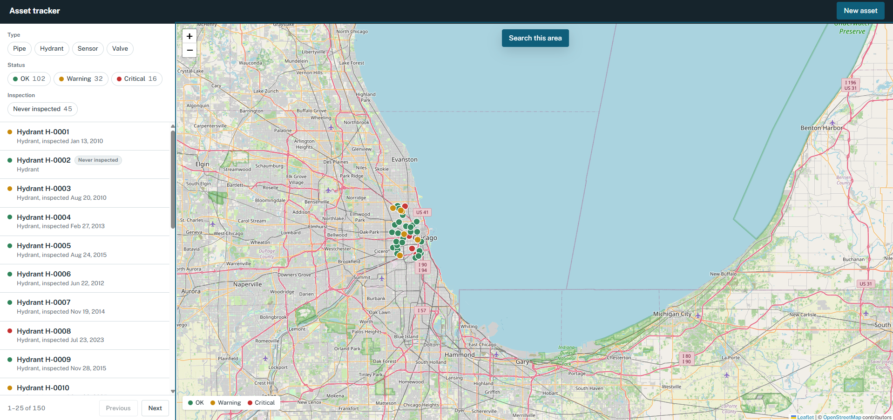

# Asset tracker



A small web app for an asset team to see, filter, find, create, edit and delete physical assets on a map.

- **Backend:** Node.js, Express 5, TypeScript, PostgreSQL + PostGIS
- **Frontend:** React 19, TypeScript, Vite, Leaflet (react-leaflet), TanStack Query, react-hook-form
- **Shared:** one package of Zod schemas used by both the API and the form

## Running it

Requirements: Node 22+ and Docker (Docker Desktop on Windows).

```bash
npm install
npm run db:up      # starts PostGIS in Docker (dev DB "assets" + test DB "assets_test")
npm run dev        # API on http://localhost:3001, web app on http://localhost:5173
```

On startup the API creates the schema and seeds `server/seed.json` **if the table is empty**, so your edits survive a restart. To start fresh: `docker compose down -v` (deletes the DB volume), then `npm run db:up` again.

```bash
npm test           # schema unit tests + API integration tests (needs the DB running)
npm run typecheck  # all three packages
```

Configuration (all optional): `DATABASE_URL`, `TEST_DATABASE_URL`, `PORT`, `SEED_FILE`.

## Project structure

```
shared/   Zod schemas and API types, imported by both server and web
server/
  src/
    schema.sql                 table, generated geometry column, indexes
    db.ts, seed.ts             connection, migration, seeding
    app.ts, index.ts           app factory and startup
    http/                      error format, request logging
    assets/
      list-query.ts            parsing and validating query params (list and summary)
      assets.repository.ts     all SQL
      assets.routes.ts         thin HTTP handlers
  test/                        integration tests against a real PostGIS DB
web/
  src/
    api/                       fetch client and TanStack Query hooks
    hooks/useFilters.ts        filter state, synced to the URL
    components/                list, filters, map, detail, form, location picker
```

## API

All errors use one shape:

```json
{ "error": { "code": "VALIDATION_ERROR", "message": "Request is invalid", "details": [{ "path": "lat", "message": "..." }] } }
```

Codes: `VALIDATION_ERROR` (400), `NOT_FOUND` (404), `INTERNAL_ERROR` (500, details are logged, never returned).

### `GET /api/assets`

| Param | Example | Notes |
|---|---|---|
| `type` | `pipe,valve` | comma-separated, any of `pipe`, `hydrant`, `sensor`, `valve` |
| `status` | `warning,critical` | comma-separated, any of `ok`, `warning`, `critical` |
| `uninspected` | `true` | only assets with no inspection on record; `true` is the only accepted value |
| `bbox` | `-71.2,42.2,-70.9,42.5` | `minLng,minLat,maxLng,maxLat` (GeoJSON order) |
| `lat`, `lng`, `radius` | `lat=42.36&lng=-71.06&radius=1000` | radius in meters; all three together |
| `limit` | `50` | default 50, max 500 |
| `offset` | `0` | default 0 |

Filters combine with AND. Results are ordered by name (id as tie-breaker, so paging is stable). Unknown params are rejected with 400 rather than silently ignored, so a typo like `types=pipe` doesn't quietly return everything.

```json
{ "data": [ { "id": "...", "name": "Valve V-0001", "type": "valve", "status": "ok", "lat": 41.83, "lng": -87.65,
              "installed_at": "2001-12-22", "last_inspected_at": null, "notes": "" } ],
  "page": { "limit": 50, "offset": 0, "total": 150 } }
```

### `GET /api/assets/summary`

Counts for the current filters, in one query. Takes the same params as the list except `limit` and `offset`, which are rejected: a summary counts the whole matching set rather than a page of it.

```json
{ "ok": 102, "warning": 32, "critical": 16, "uninspected": 45, "total": 150 }
```

Each count leaves out the filter that its own chip in the UI controls, and honours all the others, so a count always answers "how many would I get if I turned this on".

| Count | Ignores | With `?status=ok` |
|---|---|---|
| `ok`, `warning`, `critical` | `status` | `102, 32, 16`, unchanged, so the other statuses are still worth clicking |
| `uninspected` | `uninspected` | `30`, the OK assets never inspected, not the fleet-wide `45` |
| `total` | nothing | `102`, the same number as `page.total` on the list |

### Other endpoints

| Method | Path | Success |
|---|---|---|
| `GET` | `/api/assets/:id` | 200 with the asset |
| `POST` | `/api/assets` | 201 with the asset and a `Location` header |
| `PATCH` | `/api/assets/:id` | 200 with the updated asset; send any subset of fields |
| `DELETE` | `/api/assets/:id` | 204 |

The resource shape matches the seed file (snake_case), so the data contract stays the one we were given.

## Decisions and tradeoffs

**PostGIS instead of in-memory.** The geospatial query is a core part of the brief, so I wanted a real spatial index rather than a loop with a haversine formula. `lat`/`lng` are plain columns (easy to read and write), and a `geom` column is *generated* from them, so the two can never disagree. That also puts the lng/lat ordering (PostGIS points are x, y) in exactly one place.

**Both geo filters, each with its own index.**
- `bbox` uses `ST_Intersects` on the geometry column. It maps directly to "what's on my screen", which is how the UI uses it ("Search this area").
- `lat`/`lng`/`radius` uses `ST_DWithin` on `geom::geography`, so the radius is real meters on the Earth, not degrees. An expression index on `(geom::geography)` keeps it indexed. I checked both with `EXPLAIN`.
- Not handled: a bbox crossing the antimeridian (minLng > maxLng is rejected). Not relevant for this data.

**Offset pagination with a total.** Simple, lets the UI show "26–50 of 137", and fine at this size. With a large or fast-changing table I'd switch to keyset (cursor) pagination on `(name, id)`, because offsets get slow and rows can shift between pages.

**Filtering and counting happen in SQL.** Both could be done in JavaScript over the rows already fetched, but the list is paginated, so the client only ever holds 25 of them. Only the server sees the whole matching set it has to page, count and summarise. So `uninspected=true` is one `IS NULL` condition in the existing WHERE builder, and the summary is a single query where `count(*) FILTER (WHERE ...)` puts five aggregates into one index scan instead of five round trips.

**Each count ignores the filter its own chip controls.** This is what makes the numbers on the chips trustworthy. If the status counts honoured `status`, picking "Critical" would leave OK and Warning reading 0, which is both useless and a dead end. If the inspection count ignored `status` as well, it would keep saying 45 while the list showed only OK assets, which is worse: a number that looks filtered and is not. So the repository splits the filters into a `scope` that no chip owns (type, area, radius) and the two chip filters. `scope` goes in the WHERE; the other two move into the `FILTER` clauses, where each aggregate picks the ones that apply to it. The list still joins all three into one WHERE, so it is unaffected.

**Validation in one place.** `shared/src/asset.ts` defines the rules once. The form uses them for instant feedback; the API runs them again because it can't trust clients. The DB has matching `CHECK` constraints as a last line of defense. The cross-field rule (last inspection not before install) is where this matters most.

**PATCH validates the merged record.** A patch like `{ "last_inspected_at": "2019-01-01" }` is valid on its own, but not if the stored install date is 2020. So the handler loads the asset, merges the patch, and validates the full result. Tradeoff: read-then-write without a transaction, so two simultaneous edits could race. Fine here; a real system would use a transaction with `SELECT ... FOR UPDATE` or an optimistic `version` column.

**Seed only when empty.** Seeding on every start would wipe user edits. The seed file is validated with the same schema before insert, so bad seed data fails loudly at startup. Inserted in one round trip via `json_to_recordset`.

**Dates stay strings.** `pg` turns `DATE` into a JS `Date` at local midnight, which can shift the day by timezone. The API keeps `YYYY-MM-DD` strings end to end.

**Frontend state.**
- Server state (assets) lives only in TanStack Query. After any write, one invalidation refreshes the list, map and detail.
- Filters live in the URL, so a filtered view survives a refresh and can be shared.
- The side panel is a single state value (`view` / `edit` / `create`), so impossible combinations can't happen.
- The list and the map run separate queries: the list pages 25 at a time, the map asks for up to 500 in view. If there are more, the map says so instead of silently dropping markers.
- The chip counts are a third query on the same filters. It is cached under the same `assets` key, so a create or an edit refreshes the counts along with everything else.